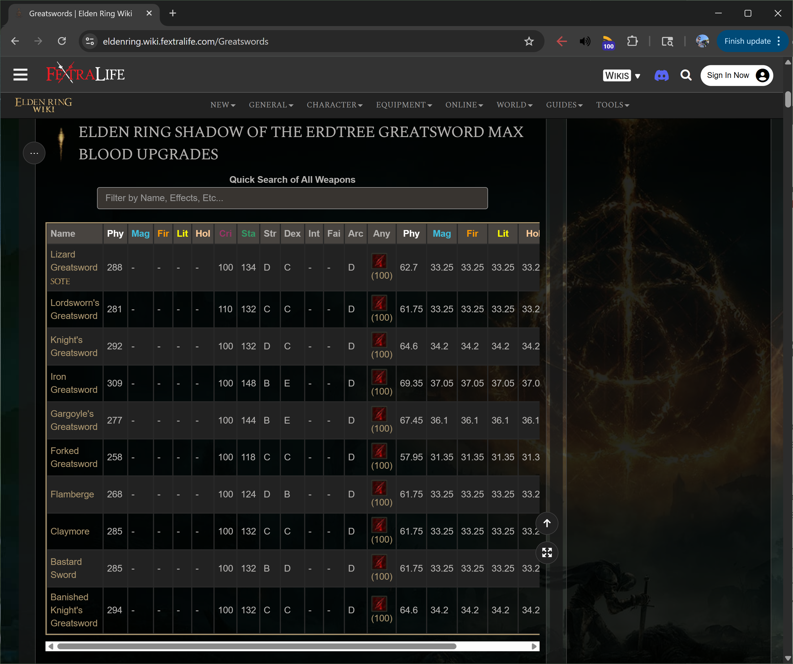
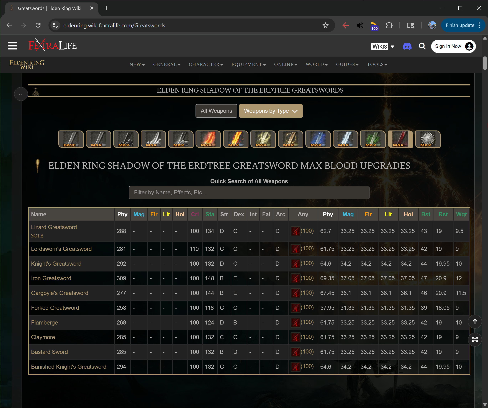

# Fextralife Viewer

If I find myself gaming with a _fextralife_ wiki pulled up on a second screen, I inevitably find myself annoyed with the huge amount of wasted space taken up by the side bar. This problem hits extra hard when I'm also using the same screen for a music player or messaging app.

This bookmarklet hides the side bar to take advantage of more of your valuable screen real estate.

## Bookmarklet
### Code
#### Non-URL-encoded
```
document.getElementsByClassName("side-bar-right")[0].style.display="none";
```
#### URL-encoded
```
javascript:void%20function(){document.getElementsByClassName(%22side-bar-right%22)[0].style.display=%22none%22}();
```

## Example

### Before


### After
