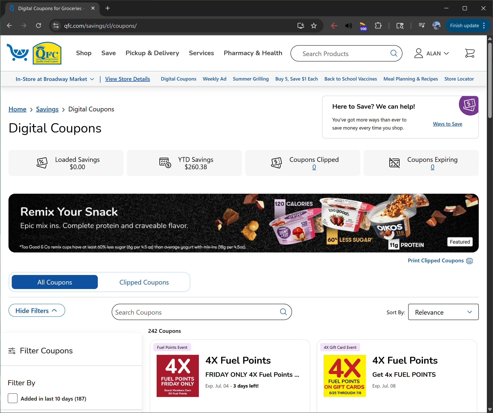
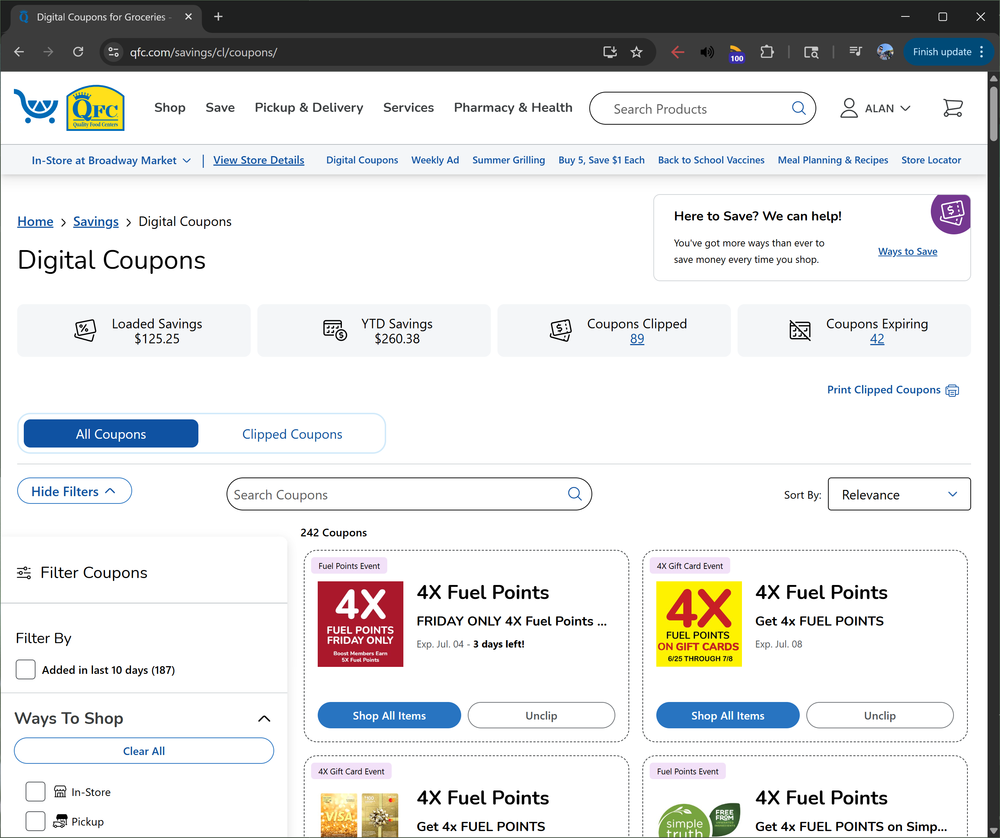

# QFC Coupon Clipper

[QFC Coupon Page](https://www.qfc.com/savings/cl/coupons/)

This bookmarklet hides a banner (personal preference) on the QFC coupon site, then scrolls to each coupon 'clip button', and clips each coupon before scrolling back to the top of the page to show the count of coupons clipped.

## Snippets from previous iterations of this bookmarklet:
### Repeatedly scrolling to the bottom to load all coupons
```
while (window.scrollY + window.innerHeight < document.body.scrollHeight) {
    window.scrollTo(0, document.body.scrollHeight);
    await new Promise(r => setTimeout(r, 500));
}
```

An iteration of this bookmarklet repeatedly scrolled to the bottom of the page with a delay to allow for loading more coupons before collecting all coupons with `getElementsByClassName()` and clicking them all. Luckily, the page will load more coupons before we reach the very end of the page. We can take advantage of this loading behaviour with the fact that `getElementsByClassName()` returns a **live** `HTMLCollection` to simply scroll to each button and click it. As we near buttons near the bottom of the page, new coupons will load in and the live `HTMLCollection` will update accordingly, allowing us to keep iterating on these new buttons.

## Bookmarklet
### Code
#### Non-URL-encoded
```
async() => {
    document.getElementsByClassName("amp-container")[0].style.display="none";
    for (button of document.getElementsByClassName("CouponActionButton")) {
        button.scrollIntoView({behavior: "smooth", block: "center"});
        if (button.innerHTML === "Clip") {
            button.click();
            await new Promise(r => setTimeout(r, 200));
        }
    }
    window.scrollTo({top: 0, behavior: "smooth"});
}
```
> Timeout parameter can be changed to be faster or slower depending on your internet connection

> `scrollIntoView` behaviour can be changed to `'instant'` for a 'snappier' feel
#### URL-encoded
```
javascript:(async()=%3E{document.getElementsByClassName(%22amp-container%22)[0].style.display=%22none%22;for(button%20of%20document.getElementsByClassName(%22CouponActionButton%22))button.scrollIntoView({behavior:%22smooth%22,block:%22center%22}),%22Clip%22===button.innerHTML%26%26(button.click(),await%20new%20Promise(r=%3EsetTimeout(r,200)));window.scrollTo({top:0,behavior:%22smooth%22})})();
```

## Example

### Before


### After
