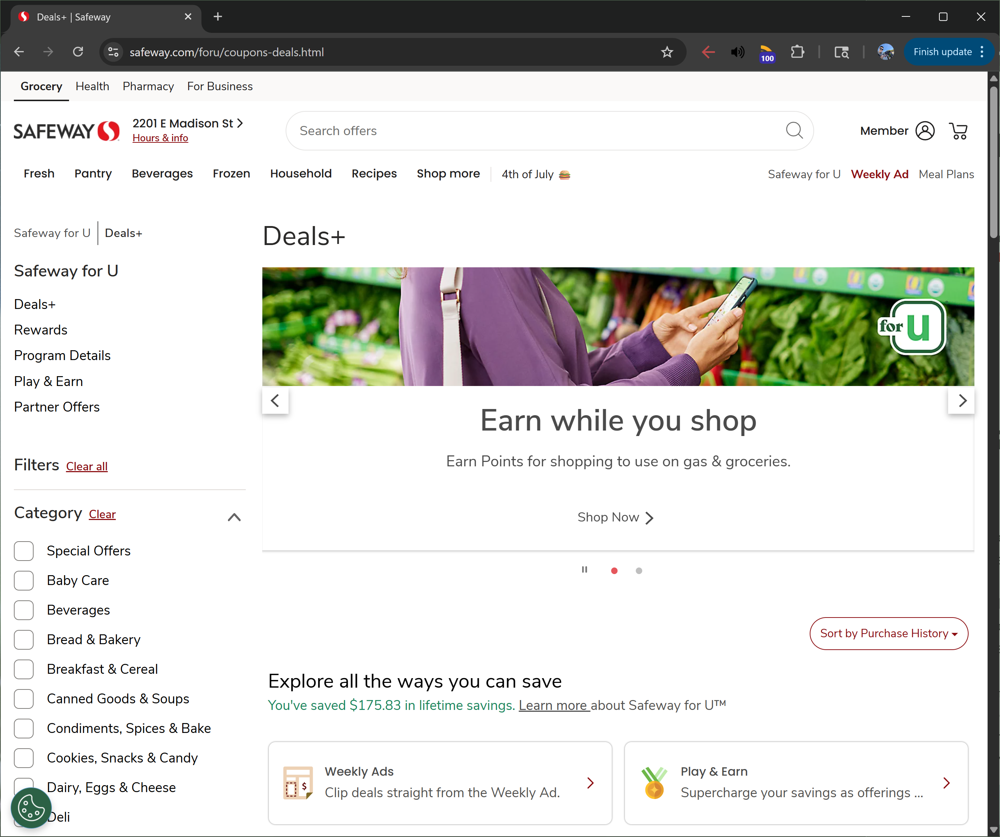
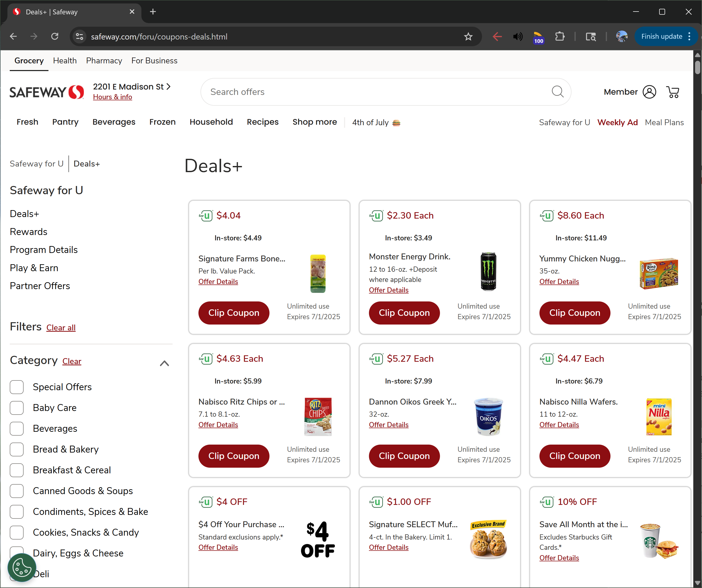

# Safeway Coupon Loader

[Safeway Coupon Page](https://www.safeway.com/foru/coupons-deals.html)

I sincerely wish that the person who invented grocery store digital coupons is sleeping on a hot pillow. I'm already shopping in your store, with a loyalty account, and now I have to download your store's app and scan a QR code for each(!) deal, often in a store with non-existent cell service and non-functioniong guest wifi. 😠

This bookmarklet hides some of the unnecessary elements on Safeway's coupon page and continually clicks the **load more** button to load up all the coupons. You can then set your cursor on the **clip coupon** button and keep clicking to clip all the coupons, as each coupon will move to the bottom of its section after it is clipped. An autoclicker set to 750ms works for me. When you have clipped all the coupons in one section, you will need to scroll down to the next section to clip the next section's coupons.

An iteration of this bookmarklet attempted to gather the **clip coupon** elements into an array and loop through them to click on them to clip all the coupons automatically. However neither using `HTMLElement.click()` nor firing off click events would clip the coupons. If you have any leads on how to get this working, feel free to open an issue!

## Bookmarklet
### Code
#### Non-URL-encoded
```
async() => {
    document.getElementsByClassName("abs-carousel")[0].style.display="none";
    document.getElementsByTagName("sort-by")[0].style.display="none";
    document.getElementsByTagName("launchpad-headline-al-v1")[0].style.display="none";
    document.getElementsByTagName("launchpad-al-v1")[0].style.display="none";
    document.getElementsByClassName("section-heading")[0].style.display="none";
    let load = document.getElementsByClassName("load-more")[0];
    while (load) {
        load.click();
        await new Promise(r => setTimeout(r, 500));
        load = document.getElementsByClassName("load-more")[0]
    }
}
```
> Timeout parameter can be changed to be faster or slower depending on your internet connection
#### URL-encoded
```
javascript:(async()=%3E{document.getElementsByClassName(%22abs-carousel%22)[0].style.display=%22none%22,document.getElementsByTagName(%22sort-by%22)[0].style.display=%22none%22,document.getElementsByTagName(%22launchpad-headline-al-v1%22)[0].style.display=%22none%22,document.getElementsByTagName(%22launchpad-al-v1%22)[0].style.display=%22none%22,document.getElementsByClassName(%22section-heading%22)[0].style.display=%22none%22;for(let%20load=document.getElementsByClassName(%22load-more%22)[0];load;)load.click(),await%20new%20Promise(r=%3EsetTimeout(r,500)),load=document.getElementsByClassName(%22load-more%22)[0]})();
```

## Example

### Before


### After
