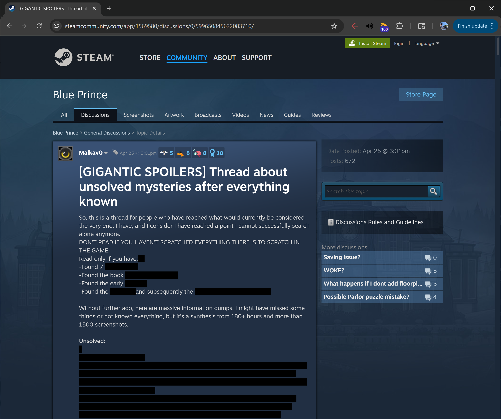
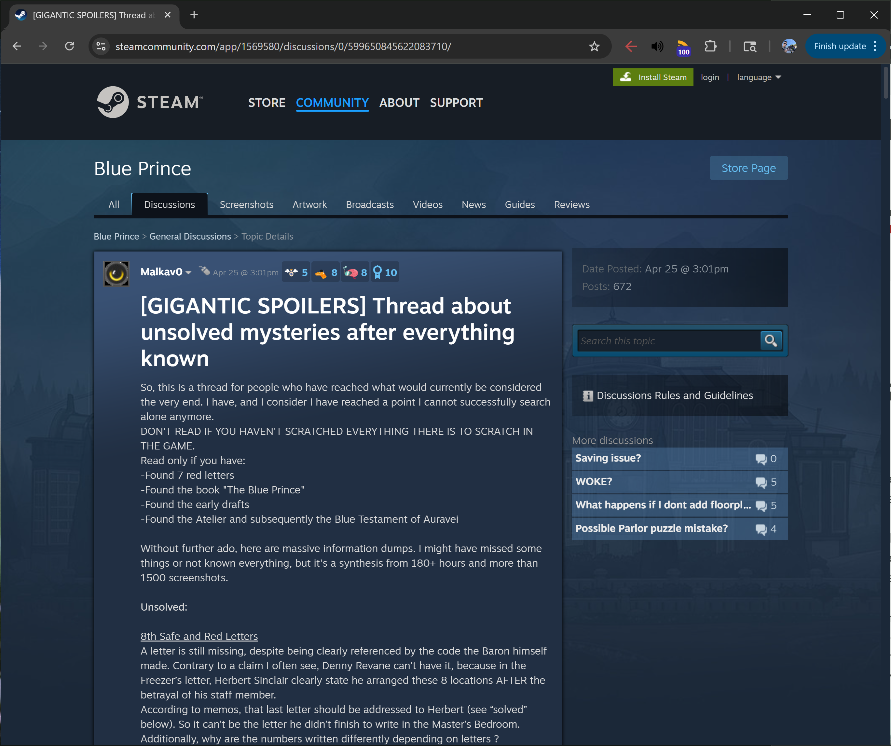

# Steam Spoiler Viewer

When I'm looking up a guide for a game on Steam, sometimes I just need the answers. Guide writers mean well to cover up parts with spoiler tags, but it can be difficult to keep hovering over the spoilers to read them. Or worse, needing to hover over several spoiler tags just to read one sentence.

This bookmarklet removes the `bb_spoiler` class from each spoiler-tagged piece of text to reveal all spoilers without the need to mouse over each one.

## Bookmarklet
### Code
#### Non-URL-encoded
```
Array.from(document.getElementsByClassName("bb_spoiler"))
    .forEach((s)=>{s.classList.remove("bb_spoiler")});
```
#### URL-encoded
```
javascript:(()=%3E{Array.from(document.getElementsByClassName(%22bb_spoiler%22)).forEach(s=%3E{s.classList.remove(%22bb_spoiler%22)});})();
```

## Example

> **WARNING: SPOILERS FOR *BLUE PRINCE* GAME**

### Before


### After
