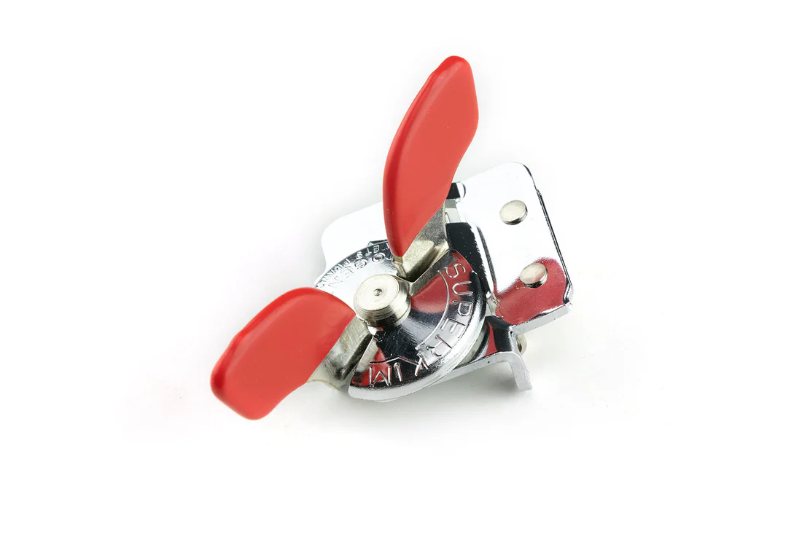

# Kitchen

#### Nogent Super Kim Can Opener
This tiny can opener takes up no space at all in your kitchen cupboard. It is also easier to use with its tempered steel cutter, compared to squeezing the round blade of a regular can opener into a can.

|  | 
| --- | --- |

#### Silicone Ladle
A ladle with a flexible silicone bowl is great for scooping up the last bits of your soups and stews as it conforms to the shape of your pot.

|  |
| --- |