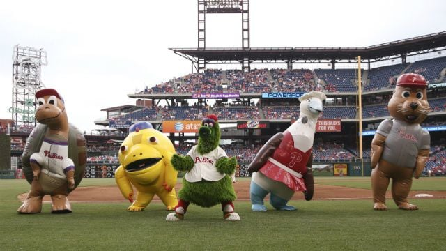

# Philadelphia Phillies

The Philly Phanatic is canonically from the Galapagos Islands.

In 1978, the Phanatic travelled to Philadelphia with dreams of becoming the greatest mascot in baseball history.

In July 2015, his friends came to visit. They are known as the Galapagos Gang.
* Sid the sea lion
* Calvin the giant tortoise
* Iggy the land iguana
* Bessie the blue-footed boobie

